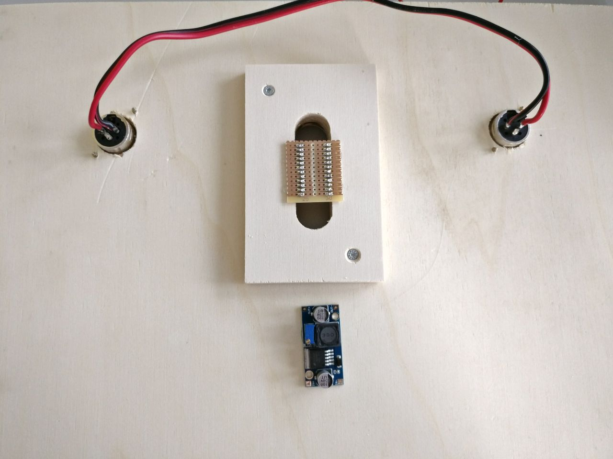
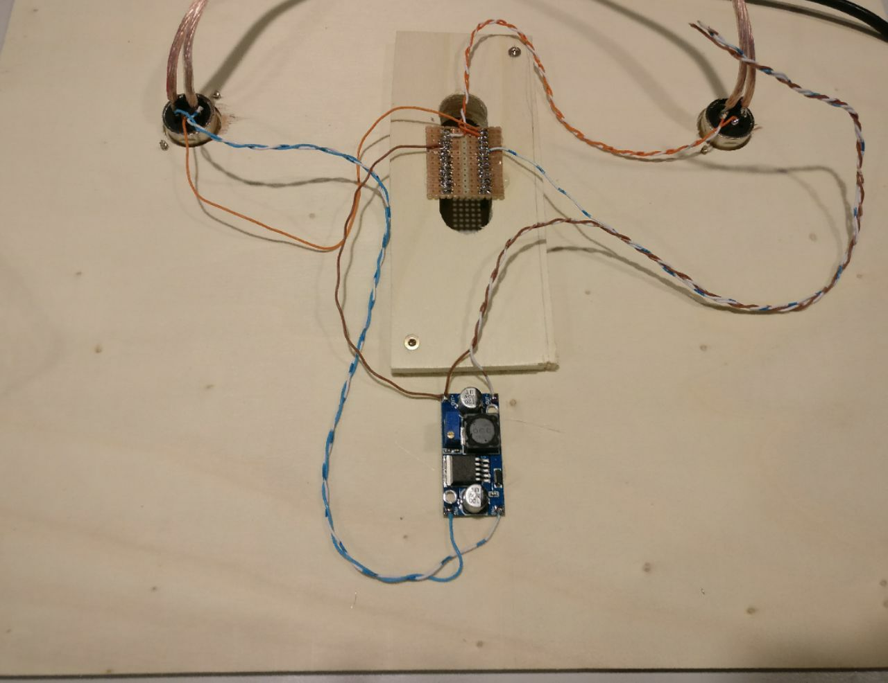

# Wiring Instructions Step by Step
Start with the following plywood plate:

### Step 1
Connect the 12V power passthrough cable

### Step 2
Connect the 12V power from the XLR input

### Step 3
Connect the regulated 5V to the Arduino 5V/VCC pin

### Step 4
Connect XLR data in and GND to Arduino RX and GND pins

### Step 5
Connect the Arduino TX pin to XLR data out

### Step 6
Connect the 5V power wires for the LEDs to the buck converter

### Step 7
Connect the LED data wire to Arduino pin 2

### Step 8
Connect the three open cables from step 7 to the input of LED string accordingly