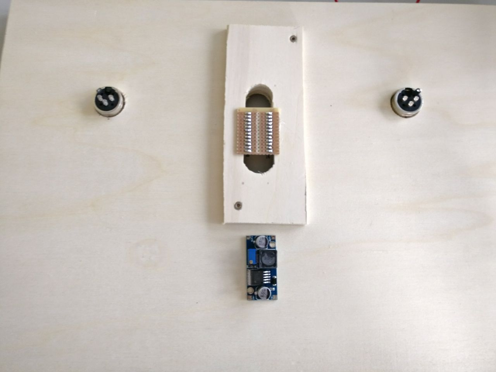
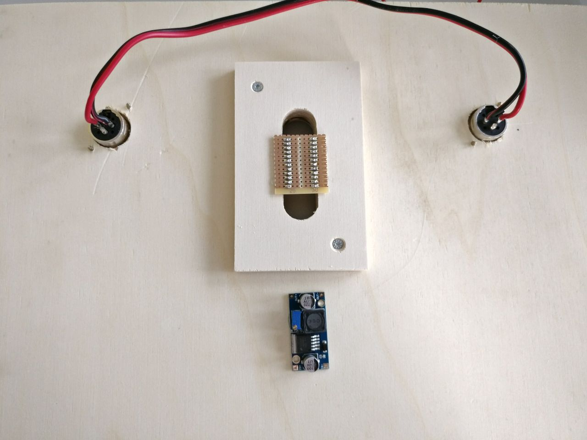
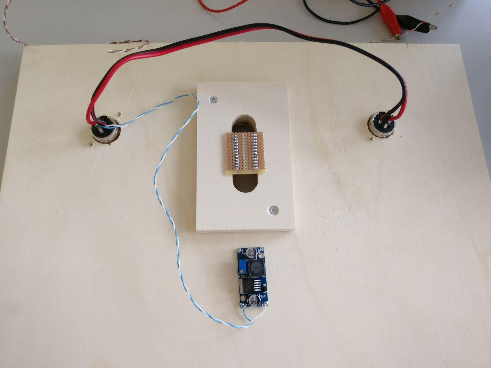
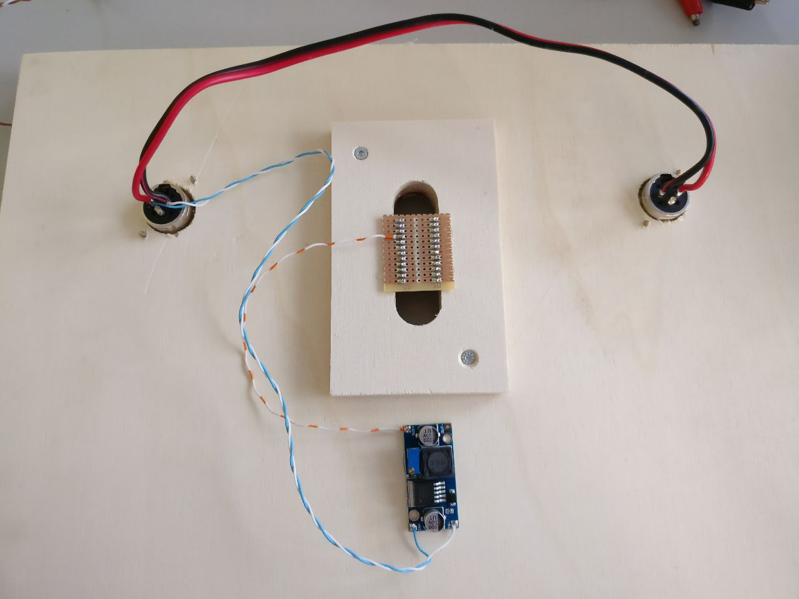
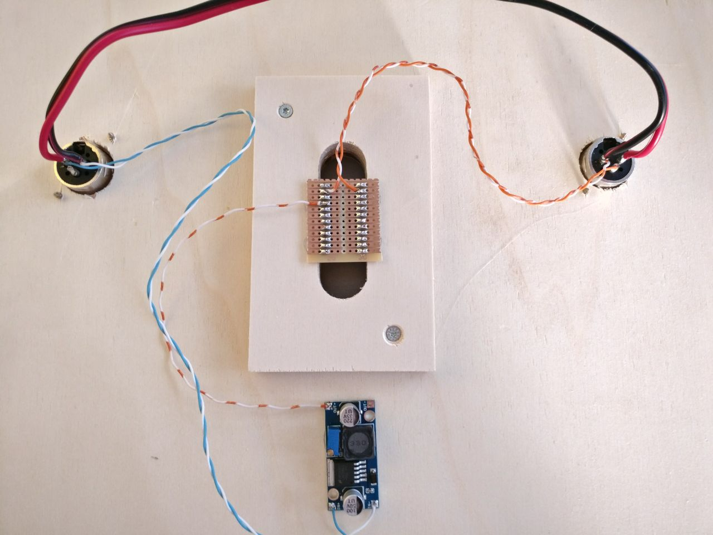
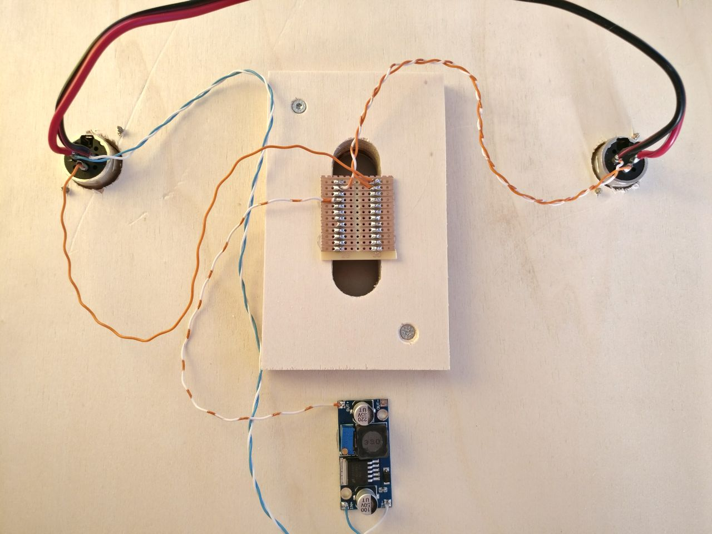
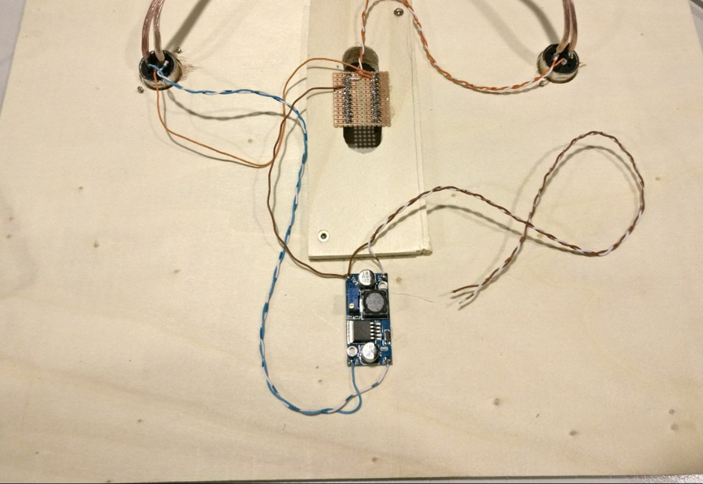
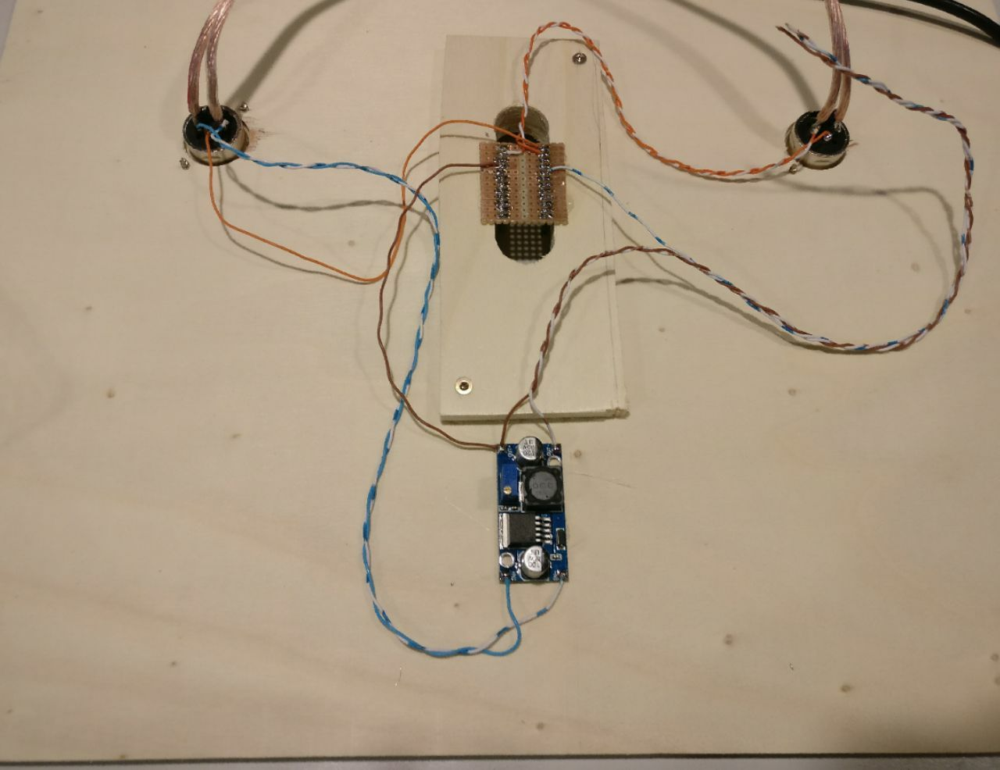

# Was ist das MateLight?

Das MateLight ist eine interaktive LED-Installation. Es besteht aus RGB-LEDs und Club-Mate-Kästen. 
Damit ergibt sich ein Raster mit bunten Punkten. Also quasi ein Display.

Das MateLight ist klassischer Nerd-Shit. Es erfüllt keinen wirklich sinnvollen Zweck und wurde geschaffen, weil man es kann.
Aber für ein paar Dinge kann man es schon verwenden. Es kann z.B. hervoragend als Effektbeleuchtung bei Veranstaltungen
eingesetzt werden. Außerdem ist es ein tolles Spielzeug für Programmier-Padawane. Man jage ein paar Zahlen hinein
und betrachte die bunt blinkende Welt.
       
       
# Wo kann ich das MateLight sehen?
 
Auf der MakerFaire in Hannover

Oder an jedem Coding-Donnerstag im [Maker Space](https://makerspace.experimenta.science)

# Made at code for Heilbronn</h2>

Das MateLight wurde von den Teilnehmern der Coding-Abende bei [CodeFor Heilbronn](https://codeforheilbronn.de/) entwickelt und hergestellt.

# Contributors

img/contributors/theVale98.jpg
* TheVale98
    * Hardware

img/contributors/LeoDJ.jpg
* LeoDJ
    * Hardware, Software

img/contributors/Franz.jpg

* Franz
    * Hardware

'img/contributors/harmoniemand.jpg
* Jonathan
    * Software

# Wie kann ich helfen?

Hilfe können wir immer brauchen um neue Kästen zu bauen. Dazu sollte man löten können.
Wir treffen und immer Donnerstags. Zwar wird nicht immer und ausschließlich am MateLight gearbeitet, aber 
immer öfter.

Außerdem kann das MateLight um coole neue Funktionen erweitert werden. Seien es Spiele oder der geplante Webservice.
Dazu sollte man NodeJS oder Arduino (C++) programmieren können.

# Wiring Instructions Step by Step
Start with the following plywood plate:

### Step 1
Connect the 12V power passthrough cable

### Step 2
Connect the 12V power from the XLR input

### Step 3
Connect the regulated 5V to the Arduino 5V/VCC pin

### Step 4
Connect XLR data in and GND to Arduino RX and GND pins

### Step 5
Connect the Arduino TX pin to XLR data out

### Step 6
Connect the 5V power wires for the LEDs to the buck converter

### Step 7
Connect the LED data wire to Arduino pin 2

### Step 8
Connect the three open cables from step 7 to the input of LED string accordingly
